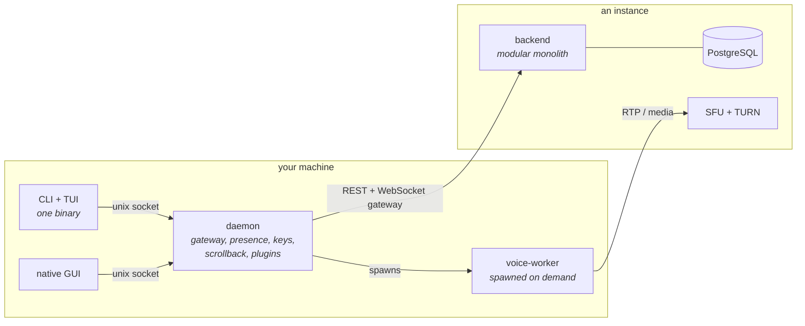

# Norite

**Voice-and-text chat with a terminal client that does everything the desktop one does — voice calls
included.**

Norite is a chat platform in the shape most people already know: servers, channels, roles, DMs, voice.
What it does differently is refuse to treat the terminal as a second-class place to use it. The CLI and
the full-screen TUI are not companions to a "real" app — they share one command tree with it, and they
place and receive voice calls.

Four clients, one backend, one local daemon per machine. You can use the **public flagship** — the open
instance operated by the project's author — or run your own, on your own terms. Both are the same
software.

[](LICENSE)
[](go.work)
[](https://github.com/Alexnex31/Norite/actions/workflows/ci.yml)
[](#status)
[](docs/roadmap.md)

> [!WARNING]
> **Early implementation. There is no product yet.** Accounts, sessions, two-factor and OAuth work.
> Guilds, channels, messages and voice do not exist — those begin at `M12`. See [Status](#status) for
> exactly what is built, and note that the full scope here is multi-year work.

---

## Contents

- [Status](#status)
- [How Norite is put together](#how-norite-is-put-together)
- [Clients](#clients)
- [Planned v1 scope](#planned-v1-scope)
- [Compared to Discord](#compared-to-discord--the-plan)
- [Running it locally](#running-it-locally)
- [Deployment shapes](#deployment-shapes)
- [Tech stack](#tech-stack)
- [Documentation](#documentation)
- [Contributing](#contributing)
- [Security](#security)
- [License](#license)

---

## Status

**Foundation and auth are done — `M0` through `M11a`. `M12` opens the guild, channel and permission
core.**

<details>
<summary><b>What exists today, milestone by milestone</b></summary>

| Milestone | Built |
| --- | --- |
| `M0` | Monorepo, Go workspace, CI |
| `M1` | Backend skeleton — chi router, pgx pool, advisory-lock-guarded auto-migration, structured logging, rate limiting, `/healthz` |
| `M2` | The `norite` command tree and the instance setup wizard |
| `M3` | The user-scoped background daemon's lifecycle |
| `M4` | Accounts with argon2id, device-scoped refresh-token families, scoped API tokens |
| `M5` | Transactional email and password reset |
| `M6` | OAuth sign-in with Google and GitHub |
| `M7` | `norite login`, using the credential the daemon starts with |
| `M8` | OAuth loopback login — system browser, localhost callback |
| `M9` | Headless fallback — a code completed in a browser on another device |
| `M10` | End-to-end instance setup: `norite instance init`, then `norite instance bootstrap` for the first administrator, with invite codes gating who else may join |
| `M11` | The general-purpose revoke-all-sessions-and-tokens primitive |
| `M11a` | Two-factor authentication — TOTP enrollment and verification, single-use recovery codes, threaded through every path that establishes a session: login, the OAuth exchange, and device-code approval |

</details>

Registering an address that already has an account is indistinguishable from registering a new one, and
an address is confirmed by email before its account can be used.

**No product features exist yet** — no guilds, channels, messages, or voice. Those begin at `M12`.

> [!NOTE]
> **On releases.** Nothing ships as a release before the milestone sequence is complete. At each phase
> boundary a beta build goes to a small group of testers: enough to exercise what that phase added, not a
> public launch and not a support commitment. There is exactly one official v1, after every milestone is
> done and the whole thing has been reviewed and tested. The public flagship accepts no non-developer
> account before then.

[`docs/roadmap.md`](docs/roadmap.md) is the dependency-ordered sequence, `M0` through `M125`, each with a
checkable "done when" condition. Read it as a long-term critical path, not a near-term promise.

---

## How Norite is put together

A backend, and on each user's machine one background daemon per OS user account. The daemon holds the
real gateway connection and does the real work: presence, scrollback, credential material, the plugin
host, local bot automation. The CLI, TUI and GUI are thin UIs that attach to it, so all three see the same
state and none of them owns a connection of its own.

Voice deliberately does not live in the daemon. A separate voice-worker subprocess, spawned on demand,
owns the whole audio pipeline — so a media bug cannot take down messaging or presence.



The backend is a Go modular monolith: one deployable, organised so pieces could be peeled into services
later without building service separation now.

---

## Clients

Build order is the terminal clients first, the native GUI second, the web SPA third.

**CLI** — the scriptable half. Unix-style: one action, then exit. `--json` on every data-printing verb, so
it pipes.

**TUI** — where a person actually spends time. A Discord-shaped layout (guild rail → channel list →
message area → member list) with tmux-like pane splitting and Emacs-style chorded keybindings, specified
screen by screen in [`docs/design/tui/`](docs/design/tui/): 26 screens with stable ids, a keymap, design
tokens, and an HTML mock of each. The reasoning for treating it as a first-class client rather than a
companion is in [ADR 0026](docs/adr/0026-tui-as-a-first-class-client.md).

The CLI and the TUI ship in one binary and share one command tree, which is what keeps the scriptable
surface and the interactive one from drifting apart: every verb is runnable from the TUI's `M-x`.

The shape it is aiming for, once `M43` renders messages:

```
┌───┬──────────────┬────────────────────────────────────────────┬──────────────┐
│ ▪ │ # general    │ alice  14:02                               │ ONLINE — 3   │
│ ▫ │ # dev        │   pushed the ratchet fuzz targets          │  alice       │
│ ▫ │ # voice ((•))│                                            │  bob    ((•))│
│   │              │ bob    14:03                               │  carol       │
│ ▫ │ ── DMs ──    │   reviewing now                            │              │
│ ▫ │ @ alice   1  │                                            │ IDLE — 1     │
│   │ @ bob        │─────────────────────────────────────────── │  dave        │
│   │              │ > │                                        │              │
└───┴──────────────┴────────────────────────────────────────────┴──────────────┘
  C-x b  buffers    C-c v  join voice    M-x  any command
```

**Native GUI** — mirrors the TUI's information architecture, immediate-mode and GPU-rendered.

**Web SPA** — built later, with its own cookie-based auth exchange layer.

---

## Planned v1 scope

None of this is built. All of it is v1 rather than a later phase — the roadmap is ordered so the
foundations land first, not so that scope gets dropped at the end.

- **Guilds, channels, roles and permissions**, with real-time messaging over a WebSocket gateway
  (op-codes, a HELLO/IDENTIFY/READY handshake, heartbeats, RESUME).
- **Voice calling on every client**, terminal ones included — a custom SFU, an embedded TURN server, noise
  suppression, echo cancellation, AGC, adaptive bitrate. Video and screen-share are deferred, but seamed
  now so they are additive when they land.
- **BYOK end-to-end encryption**, opt-in, text-only and `DM`-only: a Signal-style double ratchet plus a
  custom device-linking flow. Gated behind a hard external-cryptographic-review release gate before it is trusted
  with real conversations.
- **DMs, group DMs, presence and invites.**
- **Public matchmaking** — guild-less ephemeral topic channels paired for voice and text, a "recently met"
  list, mutual friend requests, per-user blocks and mutes.
- **Chat power features** — Deep Work status with an `@urgent` bypass and optional offline email fallback,
  message tagging, in-channel whispers, regex notification filters, bandwidth toggles.
- **Per-guild custom emoji** and **incoming webhooks**, on every instance.
- **Developer tooling** — code block copy and fold, a shell pane running your own shell, local bot
  automation, shell piping, GitHub-aware and generic link previews, and a client-side WASM plugin system:
  sandboxed, capability-gated, headless by design.
- **P2P file transfer**, opt-in per transfer and consent-gated before any IP address is exposed.
- **Moderation** — an Instance Admin tier, platform-wide bans, a unified reports system, registration
  gating.
- **Self-hosting infrastructure** — SMTP and automatic HTTPS, both real and both deployment-time opt-outs.
  An instance runs fine with neither configured.

---

## Compared to Discord — the plan

Norite borrows Discord's shape deliberately — guilds, channels, roles, a gateway protocol built on the
same ideas — because that shape works and relearning it buys nobody anything. What follows is where it
goes somewhere else. Almost none of it is built yet; this is what the plan is for.

- **The terminal as a real client, not a curiosity.** A full-screen TUI with pane splitting and chorded
  keybindings, and a scriptable CLI with `--json` on every verb. Voice calls from both.
- **You can run it yourself.** Your instance, your database, your data, your rules on retention.
- **It is free software.** You can read it, patch it, fork it, and audit what the server does with your
  messages.
- **End-to-end encryption for text DMs**, BYOK and opt-in, behind an external cryptographic review gate.
- **Deep Work status** with an `@urgent` bypass and an optional offline email fallback — a way to be
  genuinely unreachable without being unreachable in an emergency.
- **Regex notification filters**, evaluated server-side, instead of a fixed keyword list.
- **Local bot automation.** Scripts running on your own machine against your own session, with no
  application registration and no hosted bot.
- **A sandboxed client-side plugin system**, capability-gated and supported rather than tolerated.
- **In-channel whispers, message tagging, and bandwidth toggles** for constrained connections.

Where Discord is ahead, and will stay ahead for a long time: video and screen-share are deferred here,
there are no mobile clients planned for v1, and there is no ecosystem, no user base, and — today — no
messaging at all. Discord also end-to-end encrypts every voice and video call by default; Norite's
end-to-end encryption covers text DMs only.

---

## Running it locally

Requires a container runtime, [`just`](https://github.com/casey/just), and Go for the test and lint
recipes.

```bash
just dev          # the whole stack via docker-compose, backend rebuilt on save
just test         # every Go module's tests, in parallel
just test-short   # unit tests only, no container runtime required
just lint
```

`just dev` brings up Postgres, Redis, Mailpit and the backend, and needs no local Go toolchain — the
backend builds inside the container. Mailpit is a real SMTP server that accepts everything and delivers
nothing, so verification and password-reset mail is readable at `http://localhost:8025` without
configuring a provider. The backend itself listens on `127.0.0.1:8080`.

`just test` needs a running container runtime: the backend's integration tests bring up a real Postgres
through testcontainers. Use `just test-short` on a machine without one.

The backend is configured entirely through `NORITE_*` environment variables — see
[`.env.example`](.env.example) for the full list. It applies its embedded migrations on startup, holding a
Postgres advisory lock so two processes never race, and `GET /api/v1/healthz` returns 200 only once that
has completed.

There is nothing to look at yet beyond the auth surface. `norite instance init` followed by
`norite instance bootstrap` sets up an instance and its first administrator.

---

## Deployment shapes

Two independent deployments of the same codebase, with no shared infrastructure and no multi-tenancy
between them:

- **The public flagship** — the open instance the author operates, on Kubernetes, with optional per-user
  subscription perks.
- **Your own instance** — self-hosted, wherever and however you like.

Both get the same product, the same support commitment and the same quality bar. Neither is a
reduced-effort version of the other.

The roadmap will look like it disagrees with that, so it is worth saying why it does not: Phase P spends
twelve milestones on the Kubernetes track, while self-hosting has `M96` plus bare-metal and systemd
documentation. That gap is deployment complexity, not importance — a public instance is the one deployment
that needs real horizontal scale and high availability, which is what those twelve milestones buy. See
[ADR 0021](docs/adr/0021-flagship-kubernetes-deployment.md).

There is no federation and no "platform operator" tier. Every instance stands alone and is managed by its
own Instance Admin.

Nothing in Norite is sold as a license. What is commercially available needs no grant: subscription perks
on the public flagship, and paid support, hosting or managed instances for anyone who wants them.

---

## Tech stack

**Backend** — Go; `chi` for routing; `sqlc` and `pgx` for database access, no ORM; a WebSocket gateway on
`coder/websocket`; PostgreSQL. Redis is reserved for horizontal scale-out and distributed rate limiting;
single-process instances never activate it.

**CLI** — Go, `urfave/cli` v3: nested subcommands, `--json`, `--help`, shell completions.

**TUI** — Go, Bubble Tea with Lip Gloss and Bubbles, plus its own pane and split engine, Emacs-style
chorded keybindings, and inline images where the terminal supports them.

**Native GUI** — Go, [Gio](https://gioui.org): immediate-mode, GPU-rendered, hand-built widgets for tight
memory control.

**Daemon** — Go; `wazero` for the WASM plugin sandbox, `zalando/go-keyring` for credential storage,
`pelletier/go-toml` v2 for the shared config file.

**Voice-worker** — Go, with cgo confined to this one binary: `hraban/opus`, RNNoise, and WebRTC's Audio
Processing Module. The only place cgo is allowed anywhere in the stack.

**Web SPA** (later) — React, TypeScript, Vite, TanStack Query, Zustand, Tailwind and shadcn/ui.

[`docs/architecture.md`](docs/architecture.md) has the rationale behind each choice, and
[`docs/adr/`](docs/adr/) records the contested ones individually.

---

## Documentation

- [`docs/architecture.md`](docs/architecture.md) — the canonical architecture: data model, permission
  system, daemon and client design, voice architecture, gateway protocol, REST API, security and
  performance deep dives, and the tensions this design knowingly accepts.
- [`docs/roadmap.md`](docs/roadmap.md) — the dependency-ordered milestone sequence, `M0`–`M125`.
- [`docs/design/tui/`](docs/design/tui/) — the terminal client's normative design: 26 screens with stable
  ids, the keymap, the design tokens, and an HTML mock of each screen.
- [`docs/adr/`](docs/adr/) — Architecture Decision Records.
- [`CLAUDE.md`](CLAUDE.md) — a fast-loading project summary and the non-negotiable engineering rules, for
  human contributors and AI coding agents alike.

---

## Contributing

**Issues, bug reports and questions are welcome.** Open one freely — no formality attached.

Pull requests are welcome too. What is asked of them depends on which module they touch, because the two
halves of the repository carry different constraints:

- **`daemon/`, `cli/`, `gui/`** — a `Signed-off-by` line certifying you wrote the patch and can submit it
  under the AGPL. You keep your copyright. That is the whole ask.
- **`backend/`** — a copyright assignment as well. The backend deliberately carries no copyleft
  dependency, which keeps its licensing an open question the author can still answer; a single
  contribution held by someone else would close it permanently. [ADR 0032](docs/adr/0032-agpl-license.md)
  has the reasoning.

[`CONTRIBUTING.md`](CONTRIBUTING.md) has the reasoning and the sign-off text; the assignment itself is not
drafted yet, so say so in your pull request and it will be provided. Contributors are credited either
way — this is about who can make licensing decisions, not about who wrote what.

Norite is built by one person, so please open an issue before a large pull request. A change that does not
fit the direction in [`docs/architecture.md`](docs/architecture.md) is better discussed than written.

---

## Security

Please do not report vulnerabilities in public issues. [`SECURITY.md`](SECURITY.md) describes the private
reporting path and how disclosure is coordinated.

Norite has not been reviewed by a third party. The end-to-end encryption work carries a hard release gate
requiring an external cryptographic review before it is trusted with real conversations.

---

## License

Copyright (C) 2026 Alexandre Duffez

Norite is free software: you can redistribute it and/or modify it under the terms of the GNU Affero
General Public License as published by the Free Software Foundation, either version 3 of the License, or
(at your option) any later version.

Third-party components keep their own license terms. Each binary embeds the full notices for the modules
it actually links — `norite licenses` prints the CLI's, `norite-daemon -licenses` the daemon's — and every
release archive carries them as `THIRD-PARTY-NOTICES.txt` alongside the binary.

The name "Norite" and the project's branding are not licensed under the AGPL. Under section 7(e), no
permission is granted to use them for forks or derivative services in a way likely to cause confusion.

**So, to be plain about forking:** go ahead. Fork it, self-host it, modify it, run it for other people —
the AGPL grants all of that and it is meant sincerely. The one thing that is not on the table is the name.
Ship your fork under your own, and everything else is yours.

The full license text is in [`LICENSE`](LICENSE). The reasoning behind this choice, and what it means for
running your own instance, is in [ADR 0032](docs/adr/0032-agpl-license.md).